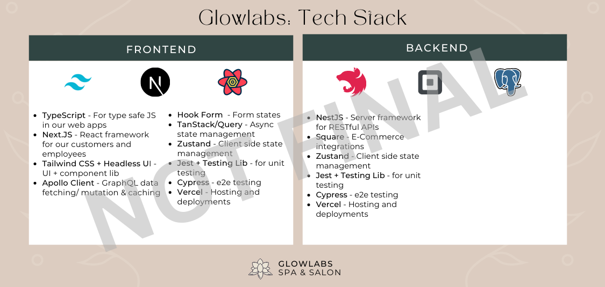

<!-- SHIELDS -->

<!-- PROJECT LOGO -->
<br />
<p align="center">
  <a href="https://github.com/sasquatchdevs/glowlabs" title="Our current tech stack">
    
  </a>

  <h3 align="center">Glow Labs Spa and Salon a
	<a href="https://github.com/nooku/guides.nooku.org/blob/master/essentials/BREAD.md" title="Browse, Read, Edit, Add, Delete">B.R.E.A.D.</a> Application</h3>

  <p align="center">
    A <a href="https://create.t3.gg/" title="T3 app">TypeScript, Tailwindcss, tRPC</a> stack appointment scheduling and employee/client management application
    <br />
    <br />
    <a href="#hosted-url">View Demo</a>
     ·
    <a href="#youtube-video">Watch Video Demo</a>
    ·
    <a href="https://github.com/sasquatchdevs/glowlabs/issues">Report Issue</a>
  </p>
</p>

## Background

> Glow Labs, a small business, has been using [Square](https://squareup.com/us/en) for booking appointments, managing clients and employees, and as a point of sale (POS) system. Its website, [originally] built by using [Wix](https://www.wix.com/), displays its Square booking workflow in an iframe. It has also been using [WaiverForever](https://www.waiverforever.com/) for handling consent forms - clients [were] not able to receive copies.
>
> Square Appointments does not charge a monthly subscription fee if there is only one staff member. However, [a monthly charge of at least $29 for >1 members](https://squareup.com/us/en/appointments/pricing) is incurred.
> Glow Labs has several staff members and therefore has to pay a monthly fee. Square's [POS](https://squareup.com/us/en/point-of-sale/software) system is free to use and there are no setup fees or monthly subscription fees.
>
> Ideally, appointments, consent forms, and profile management would all be handled on the same domain. Also, sensitive client-entered credit card information should be handled securely and integrated with Square's POS system.
>
> ~ Original Glow Labs repo quote

## Functionality

<p align="center">
<a href="#hosted-url">
    
</a>
</span>
<br/ >
<br />

This is a T3 (TypeScript-React, Tailwindcss, tRPC) stack application that uses [Next.JS](https://github.com/vercel/next.js) for a React frontend and Next.JS API routes to scaffold a [tRPC](https://github.com/trpc/trpc) typesafe API. We use [TanStack/Query](https://github.com/tanstack/query) for data fetching and caching (asynchronous state management). It has some of the following features:

<strong>Responsive design, SEO, and performance optimizations by means of:</strong>

- Effective SEO tags tested with [metatags.io](https://metatags.io/) and favicons that were compiled with [favicon.io](https://favicon.io/).
- Image optimizations using Next.JS' built in [Image](https://nextjs.org/docs/api-reference/next/image) component, user-uploaded image compression using [browser-image-compression](https://www.npmjs.com/package/browser-image-compression) and [LZString](https://github.com/pieroxy/lz-string)).
- Lazy loading using built-in [javascript methods](https://developer.mozilla.org/en-US/docs/Web/API/Intersection_Observer_API) and animations with the [framer-motion](https://github.com/framer/motion) package.
- Automatic route level [code-splitting](https://nextjs.org/docs/migrating/from-react-router#code-splitting) provided by Next along public and protected routes.

<strong>Unauthenticated Guests are able to:</strong>

- Add and remove services and add-ons (certain combinations disallowed) to/from their shopping cart.
- Select a staff member they would like their service with (or, if no preference, select a random staff member).
- Choose an available time and date for their appointment.
- Fill out contact information and any appointment notes.
- Submit credit card information securely through [Square' Web Payments SDK](https://developer.squareup.com/docs/web-payments/overview) to hold their appointment. No credit card information is stored on Glow Labs' databases. Rather, this information goes to Square's POS).
- Book selected appointments and receive:
  - Confirmation and reminder texts via [Twilio](https://www.npmjs.com/package/twilio) and [node-cron](https://www.npmjs.com/package/node-cron) (to which they can reply to confirm their appointment).
  - Confirmation emails (created using the [MJML](https://github.com/mjmlio/mjml) markup language) via [Nodemailer](https://www.npmjs.com/package/nodemailer).
  - Link to fill out and sign a consent form.
- Log in or create an account by entering details or using [Next-Auth](https://github.com/nextauthjs/next-auth) to authenticate with Facebook via OAuth 2.0. Authentication is done by [JSON Web Tokens](https://jwt.io/introduction/) and [HttpOnly](https://owasp.org/www-community/HttpOnly) access and refresh cookies, as well as an additional client-visible "dummy" cookie after validation.

<strong>Authenticated clients are able to do all of the above, as well as:</strong>

- See upcoming and past appointments.
- Cancel an upcoming appointment.
- Save their credit card information for future bookings, if they wish (again, this card information is not saved to Glow Labs' databases, but is queried from [Square](https://github.com/square/square-nodejs-sdk)).
- Download PDF copies of their latest consent forms via [React-PDF](https://www.npmjs.com/package/react-pdf).

<strong>Authenticated staff members are able to:</strong>

- Receive real-time relevant activity updates such as new bookings or cancellations in their employee dashboard via [web sockets](https://socket.io/).
- View all clients and staff members and each individual's upcoming and past appointments, as well as PDF copies of client consent forms, if present.
- Update client and their own profile photos by uploading a photo or taking a photo with a [webcam](https://github.com/mozmorris/react-webcam).
- Add, delete, or update appointments and personal events in their own calendar.

<strong>Authenticated admins are also able to:</strong>

- Browse all clients and staff members
- Add new staff members.
- View and manage all staff members' calendars.
- Update all clients' and staff members' profile photos.
- Delete clients and staff members.

## Deployment

Fullstack application deployed with [Vercel](https://vercel.com/). With a custom domain from [hostinger](https://www.hostinger.com/).

## Local Development

To develop this project locally, follow the steps below.

### Prerequisites

You will need to have the following software installed:

- Node >=v16.x.x
- Npm >= 8.x.x
- Git

### Installation

1. Create a [Google Maps Platform](https://developers.google.com/maps/gmp-get-started) billing account, create a project, enable the Google Maps API, and get an [API key](https://developers.google.com/maps/documentation/javascript/get-api-key).
2. Create a new [Square Developer](https://squareup.com/signup?country_code=us&v=developers) account, create a new application, and get its Sandbox credentials.
3. Create a [Twilio](https://www.twilio.com/try-twilio) account and get its account SID and authorization token.
4. Create a [Facebook for Developers](https://developers.facebook.com/) account, register a new application, and get its ID and secret.
5. Clone the Github repository.
   ```sh
   git clone https://github.com/sasquatchdevs/glowlabs.git
   ```
6. Install all npm packages.
   ```sh
   npm install
   ```
7. Copy the `.env.example` as the main `.env` file. Enter your credentials, as required, in the environment file.
   ```sh
   cp .env.example .env
   ```
8. Run locally
   ```sh
   npm run dev
   ```
9. Build for production.
   ```sh
   npm run build
   ```

<!-- LICENSE -->

## License

TBA

Distributed under the X License. See `LICENSE.txt` for more information.

<!-- CONTACT -->

## Contact

Project Link: [https://github.com/sasquatchdevs/glowlabs](https://github.com/sasquatchdevs/glowlabs)

<!-- ACKNOWLEDGEMENTS -->

## Acknowledgements

- [MERN stack Glow Labs by: amamenko](https://github.com/amamenko/GlowLabs)
- [Square Developers](https://developer.squareup.com/us/en)
- [Create-T3-App](https://create.t3.gg/)
